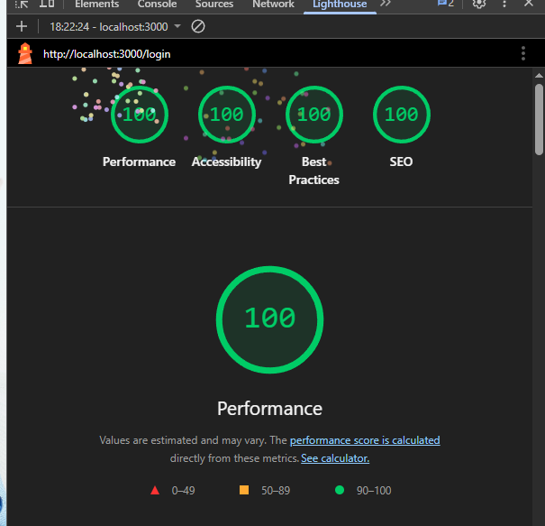

````markdown
# README

## Passos para rodar

```bash
npm i
npm run dev
```
````

## Variáveis de ambiente

- Nenhuma

## Decisões técnicas e Pendências

- Mais informações sobre no arquivo [TODO.md](TODO.md)

## Screenshots

- Lighthouse Desktop: 

```

```
